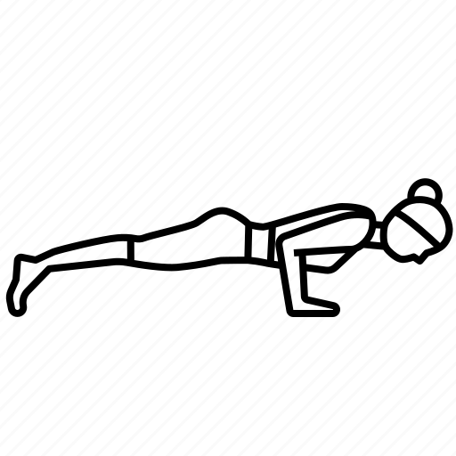

\pagenumbering{gobble}

_“When the breath wanders the mind also is unsteady. But when the breath is calmed the mind too will be still.” ~ Hatha Yoga Pradipika_

## 1. Opening Awareness                         2. Opening Stretch

     
{ width=9% }
{ width=9% }
{ width=9% }         
{ width=9% }   
{ width=9% }
{ width=9% }
{ width=9% }
{ width=9% }

     Meditation     Seated Twist     Child's Pose              Table            Cat              Cow        Down Dog      Lions' Breath

## 3. Standing Breath of Joy                  4. Floor Work

    
{ width=9% }
{ width=9% }
{ width=9% }           
{ width=9% }
{ width=9% }     
{ width=9% }
{ width=9% }

       Mountain      Extended          Forward Fold          Alligator          Cobra              Lizard           Pigeon 

## 5. Balancing Breathwork  
    
{ width=9% }
{ width=9% }
{ width=9% }         
{ width=9% }
{ width=9% }
{ width=9% }         
{ width=9% }
{ width=9% }

           Star        Warrior II    Peaceful Warrior          Chair            Boat          Butterfly                   Tree            Airplane

## 6. Inversions                                     7. Relaxation

    
{ width=9% }
{ width=9% }
{ width=9% }             
{ width=9% }   
{ width=9% }     
{ width=9% }

     Forward Fold      Leg's Up      Bridge                  Reclined Twist          Hug              Shavasana 
